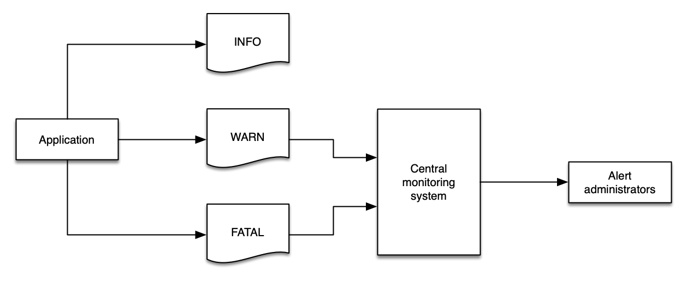

# Logs

Logs are a series of messages that are sent by an application, or an appliance, that are represented by one or more lines of details about an event, or sometimes about the health of that application. Typically, logs are delivered to a file, though sometimes they are sent to a collector that performs analysis and aggregation. There are many full-featured log aggregators, frameworks, and products that aim to make the task of generating, ingesting, and managing log data at any volume – from megabytes per day to terabytes per hour.

Logs are emitted by a single application at a time and usually pertain to the scope of that one application - though developers are free to have logs be as complex and nuanced as they desire. For our purposes we consider logs to be a fundamentally different signal from traces, which are composed of events from more than one application or a service, and with context about the connection between services such as response latency, service faults, request parameters etc.

Data in logs can also be aggregate over a period of time. For example, they may be statistical (e.g. number of requests served over the previous minute). They can be structured, free-form, verbose, and in any written language.

The primary use cases for logging are describing,

-   an event, including its status and duration, and other vital statistics
-   errors or warnings related to that event (e.g. stack traces, timeouts)
-   application launches, start-up and shutdown messages

> [!NOTE]
> Logs are intended to be immutable, and many log management systems include mechanisms to protect against, and detect attempts, to modify log data.

**CloudWatch Logs** is used to **monitor, store, and access** your log files. Essentially, it is a **centralized log management service**.

CloudWatch Logs offers two classes of log groups:

-   The CloudWatch Logs Standard log class is a full-featured option for logs that require real-time monitoring or logs that you access frequently.

-   The CloudWatch Logs Infrequent Access log class is a new log class that you can use to cost-effectively consolidate your logs. This log class offers a subset of CloudWatch Logs capabilities including managed ingestion, storage, cross-account log analytics, and encryption with a lower ingestion price per GB. The Infrequent Access log class is ideal for ad-hoc querying and after-the-fact forensic analysis on infrequently accessed logs.

- Essentially, it is a container for collection of log streams. Uses the forward slash naming convention eg. /my-app/prod/us-east/

### What can we do with CloudWatch Logs?

-   **Log Route 53 DNS queries** - We can use CloudWatch Logs to log information about the DNS queries that Route 53 receives.
-   **Log Retention** - By deafult, logs are kept indefinitely and never expire. We can adjust the retention policy for each log group, keeping the indefinite retention, or choosing a retention period between 10 years and one day.
-   **Monitor AWS CloudTrail logged events** - We can create alarms in CloudWatch and receive notifications of particular API activity as captured by CloudTrail and use the notification to perform troubleshooting
-   **Monitor logs from Amazon EC2 instances** – We can use CloudWatch Logs to monitor applications and systems using log data.
-   **Query your log data** – We can use CloudWatch Logs Insights to interactively search and analyze our log data. We can perform queries to help us more efficiently and effectively respond to operational issues.


### Structured logging is key to success

Many systems will emit logs in a semi-structured format. For example, a Java stack trace may be a single event that spans multiple lines and is less structured:

Exception in thread "main" java.lang.NullPointerException at com.example.myproject.Book.getTitle(Book.java:16) at com.example.myproject.Author.getBookTitles(Author.java:25) at com.example.myproject.Bootstrap.main(Bootstrap.java:14)

And a Python error log event may look like this:

```
	Traceback (most recent call last):
	  File "e.py", line 7, in <module>
	    raise TypeError("Again !?!")
	TypeError: Again !?!
```

Using structured logs makes it easy to process log data quickly and effectively, giving both humans and machines the data they need to immediately find what they are looking for.

The most commonly understood log format is JSON, wherein each component to an event is represented as a key/value pair. In JSON, the python example above may be rewritten to look like this:

```
	{
		"level", "ERROR"
		"file": "e.py",
		"line": 7,
		"error": "TypeError(\"Again !?!\")"
	}
```

The use of structured logs makes your data transportable from one log system to another, simplifies development, and make operational diagnosis faster (with less errors). Also, using JSON embeds the schema of the log message along with the actual data, which enables sophisticated log analysis systems to index your messages automatically.

There are two types of logs: those that have a level and those that are a series of events. For those that have a level, these are a critical component to a successful logging strategy. Log levels vary slightly from one framework to another, but generally they follow this structure:

| Level | Description                                                                                                                                   |
| ----- | --------------------------------------------------------------------------------------------------------------------------------------------- |
| DEBUG | Fine-grained informational events that are most useful to debug an application. These are usually of value to devlopers and are very verbose. |
| INFO  | Informational messages that highlight the progress of the application at coarse-grained level.                                                |
| WARN  | Potentially harmful situations that indicate a risk to an application. These can trigger an alarm in an applicaiton.                          |
| ERROR | Error events that might still allow the application to continue running. These are likely to trigger an alarm that requires attention.        |
| FATAL | Very severe error events that will presumably cause an application to abort.                                                                  |



> [!TIP]
> Logging too much data at WARN will fill your monitoring system with data that is of limited value, and then you may lose important data in the sheer volume of messages.
