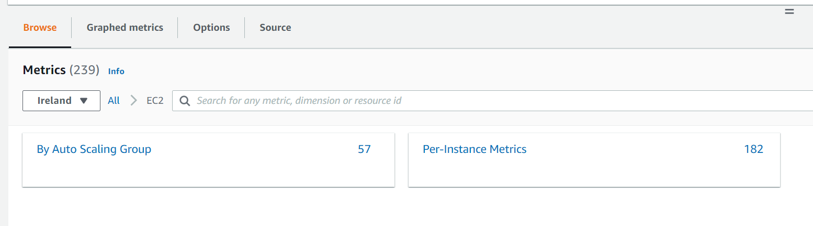

# CloudWatch Metrics for EC2 Tutorial

This tutorial aims to provide information regarding on how you can view CloudWatch Metrics on your EC2 instances.

> [!NOTE]
> Metrics exist only in Region in which they are created.

We also learnt that Metrics are uniquely defined by a **name, a namespace, and zero or more dimensions.** Each data point is a metric has a time stamp, and (optionally) a unit of measure. We can retrieve statistics from CloudWatch for any metric.

### Browse Metrics

-   In AWS Console, navigate to CloudWatch via the Services menu.
-   In the left hand navigation menu, click "**All Metrics**" under the metrics section.
-   Under "Custom Namespaces" you can see your custom metrics
-   Under "AWS Namespaces" you can see the metrics that are provided by AWS Services.
-   From here you can dive into a specific Namespace to see what metrics are available for that service.
-   Let's click on **EC2**, you should see a screen similar to the one below.
    
-   Now we can see the differnet dimensions available for the specific Namespace.

> [!TIP]
> Dimensions are ways you can group, filter, or slice metrics.

-   Let's click on the option for **Per-Instance Metrics**
-   We should see the default metrics that AWS provides for EC2 instances in your account and region.
-   We can filter for CPUUtilization in the search bar.
    

### Get Metrics via CLI - list-metrics

This command essentially list the specified metrics. You can use the returned metrics with GetMetricData or GetMetricStatistics to get statistical data as well.

-   After you create a metric, allow up to 15 minutes for the metric to appear. I guess... if there's any other way we want to check the metric statistics sooner, we have to use those two commands mentioned above.

-   https://docs.aws.amazon.com/cli/latest/reference/cloudwatch/list-metrics.html

### Resources

-   https://www.youtube.com/watch?v=AF7NogcOTvk&t=53s (0:53 - 9:33)
-   For Custom Metrics we can follow this tutorial (06:32 onwards)
